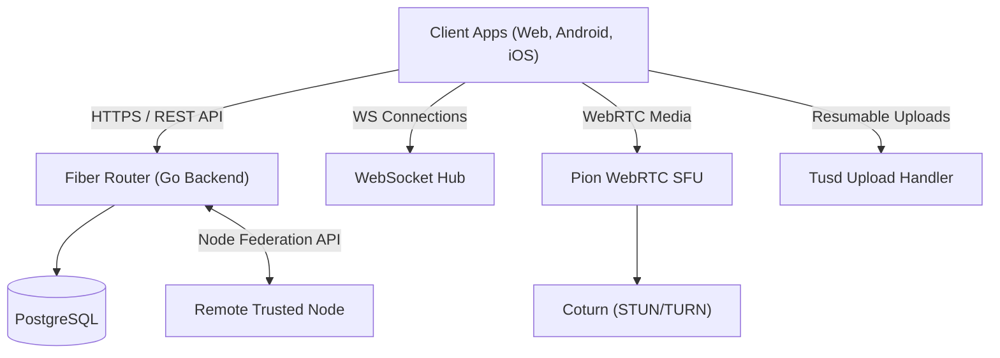

# Nit (Backend)

Nit is a private, self-hosted family messenger backend designed for text messaging, high-capacity file sharing, and real-time audio/video calls. It features a simplified, trust-based server-to-server federation model allowing independent family nodes to connect directly without relying on a centralized network.

## 🚀 Key Features

*   **Multi-Family Architecture:** Host multiple distinct families on a single server, each managed by their respective family administrators.
*   **Trusted Node Federation:** A lightweight server-to-server relay model. Explicitly peer with other self-hosted instances over HTTPS using secure API keys. Users are identified globally as `username@domain`.
*   **WebRTC Media Server (SFU):** Real-time audio and video call infrastructure built on [Pion WebRTC](https://github.com/pion/webrtc), routing all calls through a Selective Forwarding Unit for optimal performance.
*   **Resumable Large File Uploads (up to 2 GB):** Built on the [TUS Protocol](https://tus.io/) using `tusd` to support chunked, reliable, and resumable uploads over unstable network connections.
*   **Auto-Delete & Retention Policies:** Keep your storage clean. Configure server-wide message expiration or override it on a per-chat basis.
*   **Unified Push Notifications:** Send push events to Native iOS (APNs), Android (FCM), and Web App (Web Push / VAPID) clients.
*   **Fiber v3 & GORM Stack:** Designed with Go's modern high-performance ecosystem, utilizing GORM's AutoMigrate functionality for effortless database schema management.

---

## 🛠️ Tech Stack

*   **Language:** Go 1.25+
*   **HTTP Server:** Go Fiber v3
*   **Database:** PostgreSQL 16+
*   **Database Driver & ORM:** GORM
*   **WebRTC Engine:** Pion WebRTC v4
*   **Resumable Uploads:** TUS (embedded `tusd` library)
*   **Real-time transport:** WebSockets (`gofiber/contrib/v3/websocket`)
*   **Security & JWT:** `golang-jwt/v5`
*   **NAT Traversal:** coturn (STUN/TURN server)

---

## 🏗️ Architecture Overview



---

## ⚙️ Configuration (.env)

The server is configured using environment variables. Copy `.env.example` to `.env` and adjust the variables.

Key variables:
*   `SERVER_PORT`: Port to listen on (default `8080`).
*   `SERVER_DOMAIN`: The domain identity of this instance (e.g., `smith-family.chat`).
*   `DB_HOST`, `DB_PORT`, `DB_USER`, `DB_PASSWORD`, `DB_NAME`: Postgres connection parameters.
*   `MEDIA_STORAGE_PATH`: Directory on disk where uploaded media files will be saved.
*   `JWT_SECRET`: Secret key for signing authorization tokens.
*   `TURN_SERVER_ADDR`, `TURN_USERNAME`, `TURN_PASSWORD`: ICE settings for client WebRTC configuration.

---

## 🐳 Docker Deployment

To spin up the entire backend stack including the database and TURN server:

```bash
docker-compose up -d
```

This brings up:
1.  `nit-backend`: The Go application.
2.  `postgres`: Database engine.
3.  `coturn`: TURN server for handling audio/video calls behind NAT.

---

## 🤝 Contributing & License

All rights reserved. Designed for private, self-hosted family setups.
